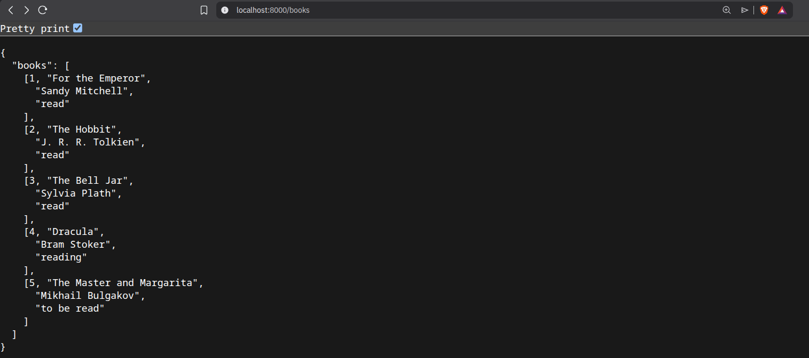

# :bookmark: Book tracker (WIP)

<p align="left">
  <a href="/github/actions/workflow/status/:user/:repo/:workflow"></a>
</p>


This repository documents the development of a simple book tracking application using FastAPI and PostgreSQL. Here, I first (1) provisioned storage and other resources on **Azure** using **Terraform**, (2) built the simple app containerised it with **Docker**, (3) built a CI/CD pipeline with **GitHub Actions**, and (4) orchestrated the cloud containers with **Kubernetes**.

## Table of Contents

- [Configure Azure with Terraform](#world_map-configure-azure-environment-with-terraform)
- [Create and containerise application](#black_nib-create-application)
- [CI/CD pipeline setup](#hammer_and_wrench-github-actions)
- [Deployment](#package-deployment)

## :world_map: Configure Azure environment with Terraform

Terraform is an Infrastructure as Code (IaC) tool that allows cloud infrastructure to be defined in configuration files, making resources easier to reproduce, review, and update.

To begin, I created three Terraform files: `main.tf`, `postgres.tf`, `variables.tf`, and `terraform.tfvars` to create the necessary resources on Azure, including a Container Registry and Postgres server:

```
# Configure the Azure provider

terraform {
  required_providers {
    azurerm = {
      source  = "hashicorp/azurerm"
      version = "~> 4.0"
    }
  }
  required_version = ">= 1.1.0"
}

provider "azurerm" {
  features {}
}

#call existing resource
data "azurerm_resource_group" "rg" {
  name = var.resource_group_name
}

#create container registry
resource "azurerm_container_registry" "acr" {
  name = var.container_registry_name
  resource_group_name = data.azurerm_resource_group.rg.name
  location = data.azurerm_resource_group.rg.location
  sku = "Basic"
  admin_enabled = false
}

#create managed PostgreSQL server
resource "azurerm_postgresql_flexible_server" "postgres" {
  name                   = var.postgres_server_name
  resource_group_name    = data.azurerm_resource_group.rg.name
  location               = data.azurerm_resource_group.rg.location
  version                = "16"

  administrator_login    = var.postgres_admin_username
  administrator_password = var.postgres_admin_password

  sku_name   = "B_Standard_B1ms"
  storage_mb = 32768
}

#create database
resource "azurerm_postgresql_flexible_server_database" "books" {
  name      = var.postgres_database_name
  server_id = azurerm_postgresql_flexible_server.postgres.id
  charset   = "UTF8"
  collation = "en_US.utf8"
}
```

I then initialised the Terraform directories by running:
```
terraform init
```
and generated a saved execution plan to review the proposed infrastructure changes before applying them:
```
terraform plan -out=tfplan
```
The plan output showed the expected resources to be created, for example `Plan: 3 to add, 0 to change, 0 to destroy`.

I then applied the saved plan:
```
terraform apply tfplan
```

I ran the following to check the state and confirm that Terraform is tracking the registry:
```
terraform show
terraform state list
```

Whenever the Azure infrastructure configuration changed, I ran `terraform plan -out=tfplan` again to review the proposed changes before applying them with `terraform apply`. 

To minimise cloud costs during development, infrastructure was provisioned through Terraform and could be recreated or removed on demand using `terraform apply` and `terraform destroy`.

I also checked that the db exists by running:
```
$ az postgres flexible-server list \
  --resource-group portfolio-rg \
  --output table

Name               Resource Group    Location        Version    Storage Size(GiB)    Tier       SKU            State    HA State    Availability zone
-----------------  ----------------  --------------  ---------  -------------------  ---------  -------------  -------  ----------  -------------------
booksdbpg-server4  portfolio-rg      <location>      16         32                   Burstable  Standard_B1ms  Ready    NotEnabled  3
```

## :black_nib: Create application

<!-- The overview of the architecture in this section looks something like this when deployed on a local machine:
```
Browser
   |
localhost:8000
   |
FastAPI Container
   |
Docker Network
   |
PostgreSQL Container
``` -->

### Setting up FastAPI

To create a `FastAPI` app, I first created two endpoints and served it locally using `uvicorn`.

Afterwards, I wrote `Dockerfile` to containerise the app, with instructions to install the required dependencies:
```
#get docker image
FROM python:3.12-slim

#set working dir
WORKDIR /app

#install dependencies
COPY requirements.txt .
RUN pip install -r requirements.txt

#copy repo
COPY . .

#run app
CMD ["uvicorn", "app.main:app", "--host", "0.0.0.0", "--port", "8000"]
```

I then built the Docker image and launched the application by running:
```
docker build -t books_db .
docker run -p 8000:8000 books_db
```

### Setting up Postgres DB

The application stored book information in a PostgreSQL database hosted on Azure Database for PostgreSQL. To initialise the database, I created an SQL script `init.sql` that contained instructions to create a table and populate it with five books, their authors, and reading status.

To simplify database deployment, I created a shell script `upload_db.sh` which executed the SQL script against the Azure PostgreSQL instance.

### Managing Docker container

After the application and database had been configured, `docker-compose.yml` was created to manage the Dockerised application:
```
services:
  api:

    build: . #builds app image
    ports:
      - "8000:8000" #host_port:container_port
```

The application could then be built by running:
```
docker compose up --build
```
or the following to stop the application:
```
docker compose down
```

After deployment, I verified that the application was functioning as intended by querying:
```
localhost:8000/books
```


## :hammer_and_wrench: GitHub Actions

GitHub Actions was configured to automatically build and test the application whenever changes were pushed to the repository. The workflow launched the FastAPI application container using Docker Compose, waits for the services to initialise, verified that the /health endpoint returned successful responses, and then removed the container regardless of whether the tests pass or fail.

The workflow then uthenticated with Azure and push the application image to Azure Container Registry. These steps were executed only during `push` events and were placed after the Docker Compose integration tests to ensure that only validated images were published.

The GitHub Actions workflow contained the following:
```
steps:

    - uses: actions/checkout@v4

    - name: Start Docker
      run: docker compose up -d --build #run in detached mode so the workflow can continue to subsequent test steps

    - name: Wait for API to start #allow fastapi and postgresql time to initialise before testing
      run: sleep 10

    - name: Show running containers
      run: docker compose ps

    - name: Check health endpoint status
      run: curl --fail http://localhost:8000/health

    - name: Show Docker logs if fail
      if: failure()
      run: docker compose logs

    - name: Shutdown Docker
      if: always()
      run: docker compose down #clean up containers even if a previous step fails

    - name: Log in to Azure
      uses: azure/login@v2
      if: github.event_name=='push'
      with:
        creds: ${{ secrets.AZURE_CREDENTIALS }}

    - name: Log in to ACR
      if: github.event_name=='push'
      run: az acr login --name booksdb

    - name: Build image
      if: github.event_name=='push'
      run: docker build -t booksdb.azurecr.io/d20:latest .

    - name: Push image
      if: github.event_name=='push'
      run: docker push booksdb.azurecr.io/d20:latest
```

## :package: Deployment

### Configure Kubernetes on Azure with Terraform

Before being able to manage the Docker application with Kubernetes on Azure, I first created the Azure Kubernetes Cluster resource to request a virtual machine to host the application using the following `.tf` script:
```
#create aks
resource "azurerm_kubernetes_cluster" "aks" {
  name = var.azurerm_kubernetes_cluster
  location = data.azurerm_resource_group.rg.location
  resource_group_name = data.azurerm_resource_group.rg.name
  #kubernetes setup
  dns_prefix          = "booksdb"
  default_node_pool {
    name       = "default" #larger companies may have frontend-pool, backend-pool, etc.
    node_count = 1 
    vm_size    = "Standard_B2s"
  }
  identity {
    type = "SystemAssigned" #creates AKS Identity for assigning permissions to
  }
}

#assign role to github repo
resource "azurerm_role_assignment" "aks_acr_pull" {
  principal_id = azurerm_kubernetes_cluster.aks.kubelet_identity[0].object_id #kublet_identity will exist after aks is created
  role_definition_name = "AcrPull"
  scope = azurerm_container_registry.acr.id
  skip_service_principal_aad_check = true
}
```

I then ran `terraform plan -out=tfplan` to update the Terraform state and confirm that I was creating two new resources by looking out for `Plan: 2 to add, 0 to change, 0 to destroy` in the output.

After creating the resources on Azure, I connected Azure to Kubernetes locally by running:
```
$ az aks get-credentials \
  --resource-group portfolio-rg \
  --name booksdb-k8
```

On my local terminal, to confirm that the resources were connected and running, I printed the information of the Kubernetes nodes with the following:
```
$ kubectl get nodes
NAME                              STATUS   ROLES    AGE     VERSION
aks-default-30271418-vmss000000   Ready    <none>   9m47s   v1.34.8
```
pods with the following:
```
$ kubectl get pods -A
NAMESPACE     NAME                                           READY   STATUS    RESTARTS   AGE
kube-system   azure-cns-2l6b7                                1/1     Running   0          11m
kube-system   azure-ip-masq-agent-4474n                      1/1     Running   0          11m
kube-system   cloud-node-manager-9859c                       1/1     Running   0          11m
kube-system   coredns-779f9587cb-m8pnq                       1/1     Running   0          11m
kube-system   coredns-779f9587cb-sbwqn                       1/1     Running   0          10m
kube-system   coredns-autoscaler-7b4685fdfc-smws2            1/1     Running   0          11m
kube-system   csi-azuredisk-node-rdpv4                       3/3     Running   0          11m
kube-system   csi-azurefile-node-mrf49                       4/4     Running   0          11m
kube-system   konnectivity-agent-7fc4d4987c-fwmsk            1/1     Running   0          11m
kube-system   konnectivity-agent-7fc4d4987c-h2z42            1/1     Running   0          10m
kube-system   konnectivity-agent-autoscaler-95f4794f-9cb6g   1/1     Running   0          11m
kube-system   kube-proxy-l5x75                               1/1     Running   0          11m
kube-system   metrics-server-5f5fbb69b-p2bg7                 2/2     Running   0          10m
kube-system   metrics-server-5f5fbb69b-xkbs5                 2/2     Running   0          10m
```
and namespaces with the following:
```
$ kubectl get namespaces
NAME              STATUS   AGE
default           Active   13m
kube-node-lease   Active   13m
kube-public       Active   13m
kube-system       Active   13m
```

We could also check that the application had not been deployed on Kubernetes yet:
```
$ kubectl get pods
No resources found in default namespace.
```

### Deploy FastAPI application to AKS

I created `deployment.yml` and `service.yml` to deploy the FastAPI container to AKS and expose it using a Kubernetes load balancer service. The PostgreSQL database was not deployed to Kubernetes, as it was hosted separately using Azure Database for PostgreSQL:
```
kubectl apply -f k8s/
``` 

Afterwards, I verified that the application was indeed in service by running the following to show the live pods:
```
$ kubectl get pods
NAME                                      READY   STATUS                       RESTARTS   AGE
booksdb-api-deployment-7b4ffb45c9-wcs6l   1/1     Running                      0          74s
```
and the following to show the live services:
```
$ kubectl get services
NAME                  TYPE           CLUSTER-IP     EXTERNAL-IP    PORT(S)        AGE
booksdb-api-service   LoadBalancer   10.0.133.121   20.70.74.200   80:32130/TCP   16s
kubernetes            ClusterIP      10.0.0.1       <none>         443/TCP        3h30m
```

To explore the logs and potential errors, I ran the following:
```
kubectl logs <pod_name>
```

Finally, I queried the external IP to confirm that the deployed API could reach the managed PostgreSQL database:


### Firewall configuration

Since the database was hosted on Azure, I ran into `timeout` errors before changing the AKS firewall configurations.

To address the error, I first got the IP address by running:
```
AKS_OUTBOUND_IP=$(az network public-ip show \
  --ids $(az aks show \
    --resource-group portfolio-rg \
    --name booksdb-k8 \
    --query "networkProfile.loadBalancerProfile.effectiveOutboundIPs[0].id" \
    -o tsv) \
  --query ipAddress \
  -o tsv)

echo $AKS_OUTBOUND_IP
```
and then the following:
```
az postgres flexible-server firewall-rule create \
  --resource-group portfolio-rg \
  --name booksdbpg-server4 \
  --rule-name allow-aks-outbound \
  --start-ip-address $AKS_OUTBOUND_IP \
  --end-ip-address $AKS_OUTBOUND_IP
```
