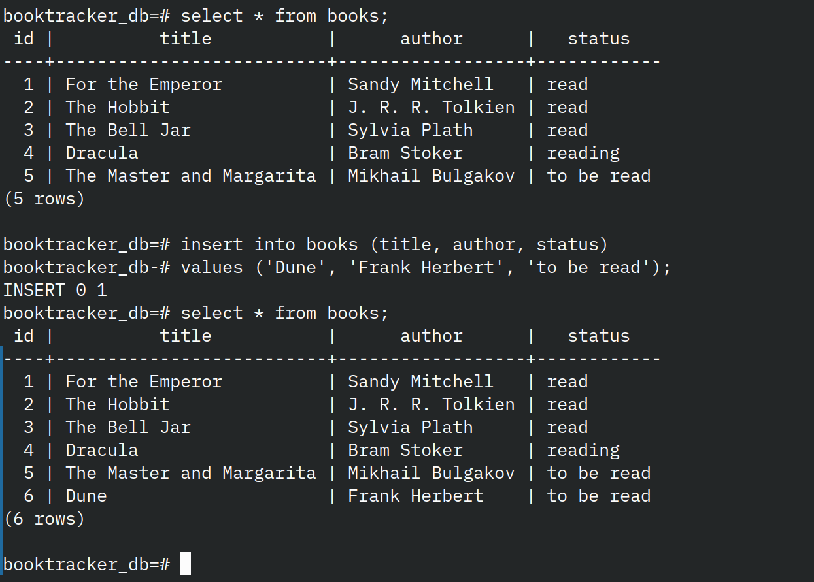

# :bookmark: Book tracker (WIP)

<!-- <p align="left">
  <a href="/github/actions/workflow/status/:user/:repo/:workflow"></a>
</p> -->


This repository documents the development of a simple book tracking application using FastAPI and PostgreSQL. Here, I (1) built the simple app, (2) containerise them with **Docker**, (3) built a CI/CD with **GitHub Actions**, (4) provisioned the infrastructure using **Terraform**, and (5) orchestrated the containers with **Kubernetes**.

## Table of Contents

- [Create application](#create-application)
- [CI/CD pipeline](#cicd-pipeline)
- [Terraform](#terraform)
- [Kubernetes](#kubernetes)

## :black_nib: Create application

The overview of the architecture in this section looks something like this when deployed on a local machine:
```
Browser
   |
localhost:8000
   |
FastAPI Container
   |
Docker Network
   |
PostgreSQL Container
```

### Setting up FastAPI

To verify that `FastAPI` was configured correctly, I first created a simple `"hello world"` endpoint and served it locally using `uvicorn`.

Afterwards, I wrote the `Dockerfile` to containerise the app, with instructions to install dependencies.

```
#get docker image
FROM python:3.12-slim

#set working dir
WORKDIR /app

#install dependencies
COPY requirements.txt .
RUN pip install -r requirements.txt

#copy repo
COPY . .

#run app
CMD ["uvicorn", "app.main:app", "--host", "0.0.0.0", "--port", "8000"]
```

To build the containerised image and launch it there, I ran

```
docker build -t books_db .
docker run -p 8000:8000 books_db
```

### Setting up Postgres DB

To generate the Postgres database, I wrote an SQL script with instructions to create and populate a table of five books, their authors, and book status. 

```
--create table
CREATE TABLE books (
    id SERIAL PRIMARY KEY,
    title VARCHAR(255),
    author VARCHAR(255),
    status VARCHAR(255)
);

--populate table
INSERT INTO books (title, author, status)
VALUES ('For the Emperor', 'Sandy Mitchell', 'read'),
('The Hobbit', 'J. R. R. Tolkien', 'read'),
('The Bell Jar', 'Sylvia Plath', 'read'),
('Dracula', 'Bram Stoker', 'reading'),
('The Master and Margarita', 'Mikhail Bulgakov', 'to be read');
```

Then, I wrote `docker-compose.yml` that defines the instructions to management the deployment of multiple Docker containers involved in this project.

```
services:
  api:

    build: . #builds app image
    ports:
      - "8000:8000" #host_port:container_port
    depends_on:
      - db #start db container before api

  db:

    container_name: postgres
    image: postgres:17

    environment:
      POSTGRES_USER: admin
      POSTGRES_PASSWORD: password
      POSTGRES_DB: booktracker_db

    ports:
      - "5432:5432" #default postgres port

    volumes:
      - ./db/init.sql:/docker-entrypoint-initdb.d/init.sql #host_file:container_file
```

And then ran the following to build and run the containers
```
docker compose up
docker compose down -v #removes associated Docker volumes and deletes any persisted database data
```

While the container is still running, in another terminal, I checked that their statuses by running
```
docker ps
```
and 
```
docker exec -it postgres psql -U admin -d booktracker_db
```
to explore or update the database.


### Connecting FastAPI app to Postgres DB

I used `psycopg` to connect the FastAPI application to the PostgreSQL database. The `/books` endpoint executed a SQL query against the database and returned the results as JSON.

During development, whenever the application code or dependencies were updated, I rebuilt and restarted the containers using
```
docker compose down
docker compose up --build
```
to ensure that the application image is using the most up-to-date code and dependencies.

After deployment, I verified that the application was functioning as intended by querying
```
localhost:8000/books
```


## :hammer_and_wrench: CI/CI pipeline

GitHub Actions was configured to automatically build and test the application whenever changes were pushed to the repository. The workflow launches the FastAPI and PostgreSQL containers using Docker Compose, waits for the services to initialise, verifies that the /health and /books endpoints return successful responses, and then removes the containers regardless of whether the tests pass or fail.

```
steps:

    - uses: actions/checkout@v4

    - name: Start Docker
      run: docker compose up -d --build #run in detached mode so the workflow can continue to subsequent test steps

    - name: Wait for API to start #allow fastapi and postgresql time to initialise before testing
      run: sleep 10

    - name: Show running containers
      run: docker compose ps

    - name: Check health endpoint status
      run: curl --fail http://localhost:8000/health

    - name: Check books endpoint status
      run: curl --fail http://localhost:8000/books

    - name: Show Docker logs if fail
      if: failure()
      run: docker compose logs

    - name: Shutdown Docker
      if: always()
      run: docker compose down #clean up containers even if a previous step fails
```

## :world_map: Terraform

coming soon...

## :package: Kubernetes

coming soon...